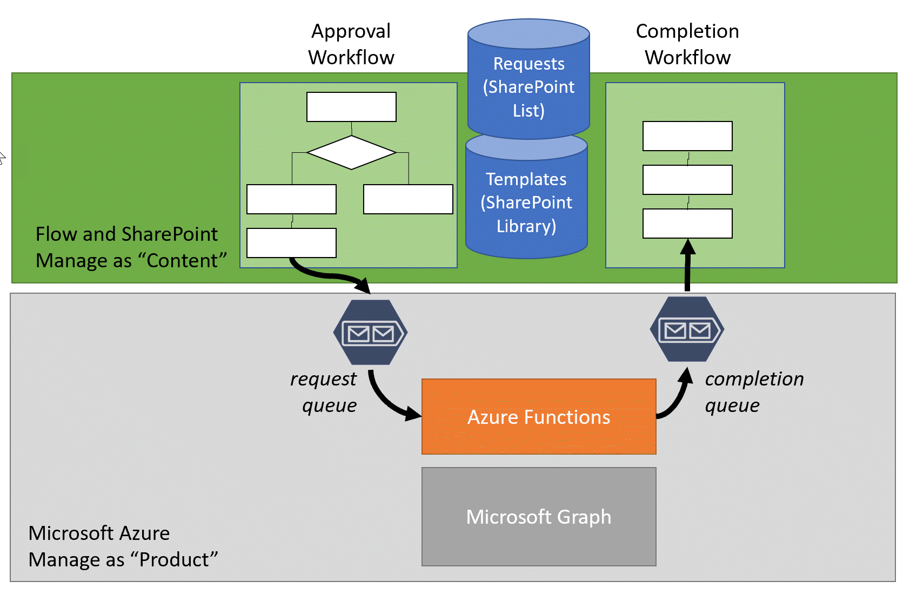

# TeamsProvisioning Sample

This repository contains a set of Azure Functions for Microsoft Teams provisioning. They're designed to work in concert with Microsoft Flow or Logic Apps to handle the business process, and to create Teams based on "templates" (JSON files) stored in SharePoint. Given these tools, a Microsoft partner or customer can create a scalable Teams provisioning solution tailored to their needs.

The documentation is organized as follows:

1. [Provisioning and Teams Templates](./Documents/01-TeamsTemplates.md)

1. [Architecture](./Documents/02-Architecture.md)

1. [Installing the Functions](./Documents/03-Installation.md)

1. [Writing a Teams provisioning Flow](./Documents/04-BuildingFlow.md)

## Prerequisites

To set up the solution, you will need to be a full administrator of:

* Office 365 Tenant and associated Azure AD
* Microsoft Azure subscription associated with the same Azure AD directory as the Office 365 Tenant
* Computer running PowerShell 5.x and [AzureRM PowerShell](https://docs.microsoft.com/en-us/powershell/azure/azurerm/install-azurerm-ps)

## Solution

Solution|Author(s)
--------|---------
Teams Provisioning Sample | Bob German, Microsoft [@Bob1German](https://twitter.com/bob1german)

## Version history

Version|Date|Comments
-------|----|--------
1.0|March 12, 2019|Initial release

## Disclaimer
**THIS CODE IS PROVIDED *AS IS* WITHOUT WARRANTY OF ANY KIND, EITHER EXPRESS OR IMPLIED, INCLUDING ANY IMPLIED WARRANTIES OF FITNESS FOR A PARTICULAR PURPOSE, MERCHANTABILITY, OR NON-INFRINGEMENT.**

---

